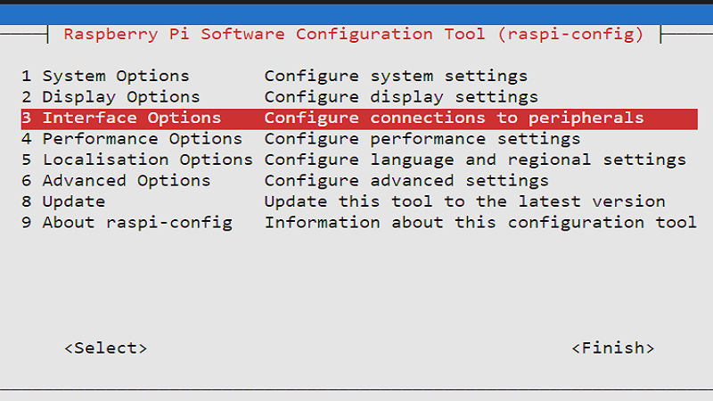
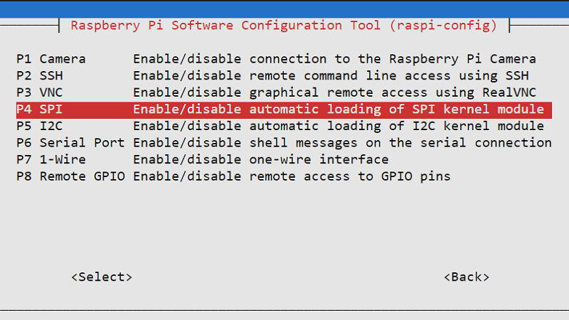
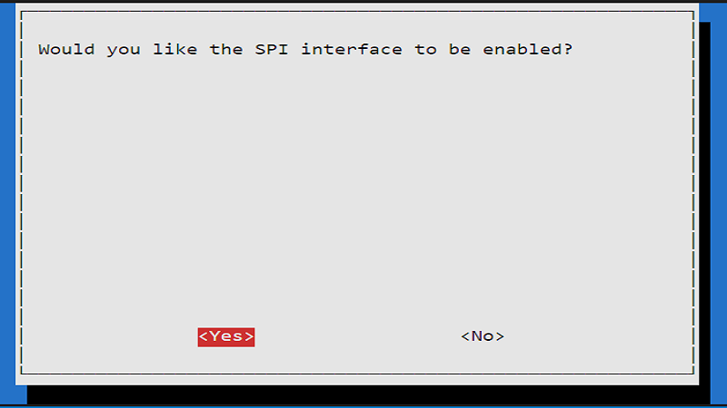

#  IoT Central Basic Bootcamp 
# Hands on Lab


# Overview
Welcome to the Azure IoT Central Basic Bootcamp and Hand On Lab. We will be settign up and end to end scenario using the Raspberry Pi as our IoT "Device" and connect all the way through to IoT Central to demostrate the power of Azure IoT Central Telemetry, Programming, Data Modeling and Data Export and Integration.

## Contents
- [IoT Central Basic Bootcamp](#iot-central-basic-bootcamp)
  - [Contents](#contents)
  - [Bill of Materials for IoT Central Bootcamp](#bill-of-materials-for-iot-central-bootcamp)
      - [Components](#components)
      - [Tools](#tools)
      - [Optional](#optional)
    - [Raspberry Pi Model 4 B](#raspberry-pi-model-4-b)
    - [AM2315 Temperature and Humidity Sensor](#am2315-temperature-and-humidity-sensor)
    - [Ultra Compact RS232 to TTL Converter with Female DB9](#ultra-compact-rs232-to-ttl-converter-with-female-db9)
    - [Screw Terminal Block Breakout Module for Raspberry Pi](#screw-terminal-block-breakout-module-for-raspberry-pi)
    - [SanDisk Ultra microSD Card](#sandisk-ultra-microsd-card)
    - [USB to RS232 Serial Cable with Prolific PL2303 Chip](#usb-to-rs232-serial-cable-with-prolific-pl2303-chip)
    - [RGB LED 10mm (Optional Status Indicator)](#rgb-led-10mm-optional-status-indicator)
  - [Assembling the Raspberry Pi and the Components](#assembling-the-raspberry-pi-and-the-components)
    - [Soldering the Connection to the TTL Converter](#soldering-the-connection-to-the-ttl-converter)
    - [Soldering and Wiring the LED](#soldering-and-wiring-the-led)
    - [Shrink Wrap the LED](#shrink-wrap-the-led)
    - [Attach the Sensors](#attach-the-sensors)
    - [Connections](#connections)
    - [Device Assembly Overview](#device-assembly-overview)
  - [Setting up your Raspberry Pi OS](#setting-up-your-raspberry-pi-os)
    - [Setting up Raspberry Pi Imager](#setting-up-raspberry-pi-imager)
    - [Enabling Options for Connectivity (NO DISPLAY OR KEYBOARD/MOUSE)](#enabling-options-for-connectivity-no-display-or-keyboardmouse)
      - [Enable ssh to allow remote login](#enable-ssh-to-allow-remote-login)
        - [Mac instructions (enable ssh)](#mac-instructions-enable-ssh)
        - [Windows instructions (ssh)](#windows-instructions-ssh)
      - [Add your WiFi network info](#add-your-wifi-network-info)
        - [Mac instructions (wifi settings)](#mac-instructions-wifi-settings)
        - [Windows instructions (wifi settings)](#windows-instructions-wifi-settings)
    - [Eject the Micro SD card](#eject-the-micro-sd-card)
    - [Install the Micro SD card in the Raspberry Pi](#install-the-micro-sd-card-in-the-raspberry-pi)
  - [Setting up the Development Toolchain for your Workstation](#setting-up-the-development-toolchain-for-your-workstation)
    - [Install Git](#install-git)
    - [Install Visual Studio Code](#install-visual-studio-code)
    - [Install Python](#install-python)
    - [Upgrading pip](#upgrading-pip)
    - [Install all the Tools for Visual Studio Code](#install-all-the-tools-for-visual-studio-code)
  - [Connecting to the the Raspberry Pi (SSH)](#connecting-to-the-the-raspberry-pi-ssh)
    - [Connecting the Pi with a Monitor, Keyboard and Mouse](#connecting-the-pi-with-a-monitor-keyboard-and-mouse)
    - [Connecting Headless (no display)](#connecting-headless-no-display)
    - [Connecting to the Raspberry Pi using SSH](#connecting-to-the-raspberry-pi-using-ssh)
  - [Configuring the Raspberry Pi](#configuring-the-raspberry-pi)
    - [Default to Python 3](#default-to-python-3)
    - [Configuring I2C](#configuring-i2c)
    - [Installing Kernel Support (with Raspi-Config)](#installing-kernel-support-with-raspi-config)
    - [Bring down this Repository to the Raspberry Pi](#bring-down-this-repository-to-the-raspberry-pi)
    - [Install all the Packages](#install-all-the-packages)
    - [Testing and Verifying I2C](#testing-and-verifying-i2c)
  - [Azure IoT Central Device Connectivity using KeyVault (OPTIONAL)](#azure-iot-central-device-connectivity-using-keyvault-optional)
    - [Create our Connection Secrets...](#create-our-connection-secrets)
    - [Get Your Credentials for Azure Login](#get-your-credentials-for-azure-login)
    - [Configuring the Secrets and Retreival from Key Vault!](#configuring-the-secrets-and-retreival-from-key-vault)
  - [Azure IoT Central Device Connectivity for Local Development](#azure-iot-central-device-connectivity-for-local-development)
    - [Create our Local Configuration File Connection Secrets](#create-our-local-configuration-file-connection-secrets)
  - [Provisioning our Our Cold Hub Device in Azure IoT Central](#provisioning-our-our-cold-hub-device-in-azure-iot-central)
    - [The Cold Hub as a Device is Provisioned!](#the-cold-hub-as-a-device-is-provisioned)
  

## Bill of Materials for IoT Central Bootcamp
The following are needed for this workshop...
#### Components
* One(1) Raspberry Pi Board (version 4) Canakit
* One(1) Breadboard Kit
* One(1) Network Cable
#### Optional
* Monitor or Raspberry Pi Touchscreen
* HDMI Mini to HDMI Standard Cable
* Keyboard
* Mouse
### Raspberry Pi Model 4 B


The speed and performance of the new Raspberry Pi 4 is a step up from earlier models. For the first time, we've built a complete desktop experience. Whether you're editing documents, browsing the web with a bunch of tabs open, juggling spreadsheets or drafting a presentation, you'll find the experience smooth and very recognisable — but on a smaller, more energy-efficient and much more cost-effective machine.
### SanDisk Ultra microSD Card


This is the SD card you will load the Raspberry Pi operating system onto and place into the Raspberry Pi board.

# Setting up your Raspberry Pi OS
It is now time to set up the Raspbian image on the SD card that you load will into the MicroSD cart slot on the Raspberry Pi. Recently the Raspberry Pi Organization published an Operating System imaging tool that is excellent.

## Setting up Raspberry Pi Imager
Let's get started with the Raspberry Pi Imaging Tool. First watch the short video on using the tool...

### Step #1 - Setup the Imager Tool
[LINK: How to use Raspberry Pi Imager | Install Raspberry Pi OS to your Raspberry Pi (Raspbian)](https://www.youtube.com/watch?v=ntaXWS8Lk34)

Install the Imager tool for your Desktop operating system...

[LINK: Raspberry Pi OS Installation Page](https://www.raspberrypi.org/software/)


Scroll the section, "Install Raspberry Pi OS using Raspberry Pi Imager" and install the software.


### Step #2 - Choose the OS and SD Card

Install the Raspbian OS Image on the SD card.

Install the MicroSD card into the SD writer connected to your desktop or Laptop.

Choose the "Raspberry Pi OS (32 Bit)" to install the whole OS and Desktop.

")

Choose the SD card connected to your computer.


### Step #3 - Write the OS

Click on the "WRITE" button and allow the process to copy, verify and complete.


### Step 4 - Eject the Micro SD card
Right-click on boot (on your desktop or File Explorer) and select the Eject option.

### Step 5 - Install the Micro SD card in the Raspberry Pi
<b>Note:</b> Turn off your Raspberry Pi!

Looking from the top of the RPi, install the SD card (the slot is on the bottom of the board) as shown in the picture below...


<b>CONGRATULATIONS</b> You have installed the Raspbian Operating System for the Raspberry Pi and are now ready to start setting things up for our ColdPack Monitoring Device.

## Configure the Raspberry Pi
Now that we have our SD card loaded with the Raspbian Operating System, we need to boot the Raspberry Pi and using the touchscreen, configure the system and the interfaces. After setting these things up we will be able to log into the Raspbery Pi from another computer and make it easier to program and run applications.

### Step 1 - Plug in a Keyboard and Mouse (or we can use the touchscreen)
We are going to configure the Raspberry Pi using a keyboard and mouse and this is the easiest way to get everything working well and verified.

### Step 2 - Open the Raspberry Pi Configuration
Open "Prefernces->Raspberry Pi Configuration"....


On the initial screen, set you password and the name of the instance. I like to use some numbering for my ColdHub pi's so that I can keep track as I test multiple devices...


Next, click the "Interfaces" tab and I set all of these to "Enable"...


Click "OK" and respond with "Yes" to reboot the Raspberry Pi and apply the configuration...


### Step 3 - Clone the "ColdHubs Code and Configuration" Repository
In this step we will clone the code and configuration scripts to the Rtaspberry Pi. The code and scripts make setting up the Pi for communication, reading sensors and device provisioning in IoT Central... a fully automated process. 

What the scripts and code enable...

* Bring all of the needed application code and configuration scripts to the Pi
* Installation of the Raspberry Pi to use the latest version of Python
* Installation of the Azure IoT SDK for Python
* Configure all of the Sensors
* Installation of the applications that support provisioing of the device and monotoring with telemetry to Azure IoT Central

#### Next we will create our Project folder and clone this repository. 

Let's get started by opening up a terminal window on the Raspberry Pi by clicking the terminal window icon (outlined in the red box at the top menu bar) and then typing "ls" followed by Enter to see list of files and directories.


Before we can pull the files from GitHub we need to setup our profile. Type the following commands into the terminal window to configure our Git Profile...

``` bash
git config --global user.name "Your Name"
git config --global user.email "your-email@example.com"
# Verify
git config --global --list
```


Type the following commands into the terminal window to clone the repository...

``` bash
mkdir Projects
cd Projects
git clone https://github.com/Larouex/cold-hub-azure-iot-central.git
```

Here are the results...


Now we have all we need to configure the Pi for the ColdHub applications. Next we will run a setup script and it will automatically confgure everything. Type the following commands into the terminal window...

### Step 4 - Run the ColdHubs Configuration Script

``` bash
# assuming you are still in the Projects folder...
cd cold-hub-azure-iot-central
git clone https://github.com/Larouex/cold-hub-azure-iot-central.git
```

# Setting up the Development Toolchain for your Workstation
I used the generic term "Workstation" as a way to differentiate that this is the main computer (workstation, laptop, etc.) that you use to do your primary development work. We assume it exists on the same network (if using an ethernet connection) and you can install the tools that will allow you to connect and develop code remotely on the Raspberry Pi.
### Install Git
Git is the tool we use for version control and management of software assets. Our workshop will use it to clone the modules and also to save anything if you want

[LINK: Git Installation Page](https://git-scm.com/book/en/v2/Getting-Started-Installing-Git)

### Install Visual Studio Code
This is the IDE we will use to write code, deploy to the RPi, etc.

[LINK: Visual Studio Code Installation Page](https://code.visualstudio.com/download)

### Install Python
Pyhon is the language we will use to build applications for the Raspberry Pi

From the Python Org:
* Python is powerful... and fast;
* plays well with others;
* runs everywhere;
* is friendly & easy to learn;
* is Open.

[LINK: Python 3 Installation Page](https://www.python.org/downloads/)

### Upgrading pip
Pip is the package manager we will use to download packages

On Linux or macOS (Open Terminal):
```
    pip install -U pip
```
On Windows (from a CMD window or Powershell):
```
    python -m pip install -U pip
```
### Install all the Tools for Visual Studio Code
These are a set of tools we will use to develop our apps on the Raspberry Pi. You can open the Extensions sidebar with "Shift+Ctrl+X) or click the icon in the side navigator bar.


## Connecting to the the Raspberry Pi (SSH)
The requirement in order to connect to your Pi from your computer can be accomplished via Wireless or with an ethernet cable connected to the RPi ethernet port.
### Connecting the Pi with a Monitor, Keyboard and Mouse

If you boot to the command line instead of the desktop, your IP address should be shown in the last few messages before the login prompt.

Using the terminal (boot to the command line or open a Terminal window from the desktop), simply type ...

```bash
hostname -I
```

Which will reveal your Pi's IP address.

### Connecting Headless (no display)
This is the documentation from the Raspberry Pi Foundation and you have a number of options...
https://www.raspberrypi.org/documentation/remote-access/ip-address.md

### Connecting to the Raspberry Pi using SSH
We will be connecting to the Raspberry Pi using the remote SSH capability of Visual Studio Code that we installed as part of our development toolchain. When you set the RPi up, we enabled the device to connect to our Wifi network. 

Now we want to find the IP address of our RPi and connect to via VS Code's Remote SSH tools. This will let us develop our code and test our application working remotely connected to the device.

Here is the documetnation on the extension for VS Code...
[LINK: Remote Development](https://marketplace.visualstudio.com/items?itemName=ms-vscode-remote.vscode-remote-extensionpack)

Here is how we will connect to the Raspberry Pi...
[LINK: Remote development over SSH](https://code.visualstudio.com/remote-tutorials/ssh/getting-started)

## Configuring the Raspberry Pi
Let's get started by making sure our Raspberry Pi (Operating System) is up to date...
``` bash
sudo apt-get update
sudo apt-get upgrade
sudo pip3 install --upgrade setuptools
```
### Default to Python 3
We want to avoid the use of Python 2 and in our scenarios, it is not used anymore and deprecated. Here is how we tell our system to use Python 3 in all scenarios...
``` bash
sudo apt-get install -y python3 git python3-pip
sudo update-alternatives --install /usr/bin/python python $(which python2) 1
sudo update-alternatives --install /usr/bin/python python $(which python3) 2
sudo update-alternatives --config python
```
Let's check what version of Python and Pip are version defaults...
``` bash
python --version
pip --version
```
### Configuring I2C
I2C is a very commonly used standard designed to allow one chip to talk to another. So, since the Raspberry Pi can talk I2C we can connect it to a variety of I2C capable chips and modules.

The I2C bus allows multiple devices to be connected to your Raspberry Pi, each with a unique address, that can often be set by changing jumper settings on the module. It is very useful to be able to see which devices are connected to your Pi as a way of making sure everything is working.

Install these packages, likely they are already installed and current...
``` bash
sudo apt-get install -y python-smbus
sudo apt-get install -y i2c-tools
```
### Installing Kernel Support (with Raspi-Config)
Run sudo raspi-config and follow the prompts to install i2c, SPI and Serial Port Hardware support for the ARM core and linux kernel
``` bash
sudo raspi-config
```
Here is the config UX running in the VS Code terminal window. Using your navigation keys, move to the "Interface Options" item and press "enter"



Using your navigation keys, move to the "P5: I2C" item and press "enter"...


Select "Yes" and press "enter"...


Using your navigation keys, move to the "P4: SPI" item and press "enter"...



Select "Yes" and press "enter"...



Using your navigation keys, move to the "P6: Serial Port" item and press "enter"...


Select "No" and press "enter"...


Select "Yes" and press "enter"...


<b>We are completed enabling capabilities on the Raspberry Pi!</b>

Reboot the Raspberry Pi and then reconnect...
``` bash
sudo reboot
```
### Bring down this Repository to the Raspberry Pi
Next we will create our Project folder and clone this repository. Goto your home directory on the Raspberry Pi...
``` bash
mkdir Projects
cd Projects
git clone https://github.com/Larouex/cold-hub-azure-iot-central.git
```
### Install all the Packages
All of the dependant packages are indicated in the "requirements.txt" file, so we will install them...
``` bash
cd src
pip install -r requirements.txt
```
### Testing and Verifying I2C
Assuming you have the Temperature & Humidity Sensor connected and all packages installed...
``` bash
python verify.py -d
```
And the output should be (your values may vary)...
``` bash
Sensor: [<adafruit_am2320.AM2320 object at 0xb6575c90>]
Humidity: 33.3%
Temperature: 25.4C
```
<b>Congratulations, you have prepared your Raspberry Pi for Development!</b>

## Azure IoT Central Device Connectivity for Local Development
There is a file in the root folder of the project named "secrets_template.json" and this file outlines the shape of Json we use to retrieve secrets. It supports Local Secrets and Key Vault usage. Copy the "secrets_template.json" to a new file named "secrets.json" in the root folder of the project. Open this file in Visual Studio Code and let's start configuring the options.

<b>IMPORTANT: Make sure to check your .gitignore to verify that "secrets.json" is in the list so it does not get checked in! The file should be dithered in your Visual Studio Code Explorer window.</b>

### Create our Local Configuration File Connection Secrets
Set "UseKeyVault" to false and fill out the section "LocalSecrets" and populate the SaS key values from your applicaiton via the Admin, Device Connection page in IoT Central. If you want to get deeper into connecting Devices to IoT Central, go here:  [LINK: Get connected to Azure IoT Central](https://docs.microsoft.com/en-us/azure/iot-central/core/concepts-get-connected)

You fill in the values into the "secrets.json" file with the pasted values from IoT Central Device Connection page.

<b>For example...</b>
````json
  "ScopeId": "<Your Scope ID from IoT Central Device Connect Page>"
````

Copy the value from the ScopeId field (outlined in red) and paste the value into the Json
````json
  "ScopeId": "0ne001F823C"
````
Complete this for the "Primary" and "Secondary" values for both "DeviceConnect->SaSKeys" and "GatewayConnect->SaSKeys"

```` json
{
  "UseKeyVault": false,
  "ProvisioningHost": "global.azure-devices-provisioning.net",
  "LocalSecrets": {
    "ScopeId": "<Your Scope ID from IoT Central Device Connect Page>",
    "DeviceConnect":{
      "SaSKeys":{
          "Primary": "<Your Primary Key from IoT Central Device Connect Page>",
          "Secondary": "<Your Secondary Key from IoT Central Device Connect Page>"
      }
    },
    "GatewayConnect":{
      "SaSKeys":{
          "Primary": "<Your Gateway Primary Key from IoT Central Device Connect Page>",
          "Secondary": "<Your Gateway Secondary Key from IoT Central Device Connect Page>"
      }
    }
  },
  "KeyVaultSecrets":{
    "KeyVaultUri": "",
    "TenantId":"",
    "ClientId":"",
    "ClientSecret":"",
    "ScopeId": "",
    "DeviceConnect":{
      "SaSKeys":{
          "Primary": "",
          "Secondary": ""
      }
    },
    "GatewayConnect":{
      "SaSKeys":{
          "Primary": "",
          "Secondary": ""
      }
    }
  },
  "Device": {
    "Secrets": {
    }
  }
}
````

## Provisioning our Our Cold Hub Device in Azure IoT Central
***NOTE:*** Provisioning is factored into this project a "stand-alone" operation. 

There are excellent tutorials on connecting devices to IoT Central and using Device Provisioning Services online and we won't try to repeat that here. If you are not familar with the concepts; please take a break and visit these topics...

* [LINK: Get connected to Azure IoT Central](https://docs.microsoft.com/en-us/azure/iot-central/core/concepts-get-connected)
* [LINK: Tutorial: Create and connect a client application to your Azure IoT Central application (Python)](https://docs.microsoft.com/en-us/azure/iot-central/core/tutorial-connect-device-python)

Let's look at all the options by runnning with --help...

````bash
python ./provisiondevice.py -h
````

<b>Output</b>
````bash
------------------------------------------------------------------------------------------------------------------------------------------
HELP for provisiondevice.py
------------------------------------------------------------------------------------------------------------------------------------------

  BASIC PARAMETERS...

  -h or --help - Print out this Help Information

  LOGGING LEVELS -  In order of declaration
  -d or --debug    - Debug Mode with Output to Assist with Tracing and Debugging
  -v or --verbose  - Verbose Mode with Output to Assist with Program Flow
  -e or --error    - Error Mode with Output of Errors from Try:Catch Handlers Only

  OPTIONAL PARAMETERS...

    -r or --registerid - This numeric value will get appended to your provisioned device. Example '1' would result in larouex-smart-kitchen-1
       USAGE: -r 5
       DEFAULT: 1

------------------------------------------------------------------------------------------------------------------------------------------
````

Let's actually provision our Cold Hub Device now...

````bash
python ./provisiondevices.py -v -r 1
````

You will get verbose output along with this confirmation...

````yaml
...
INFO: ************************************************
INFO: [PROVISION DEVICE] SUCCESS:
INFO: {'Device': {'Capabilities': [{'DisplayName': 'Temperature',
                              'InterfacelId': 'dtmi:coldHubStorage:mainComponent:temperature;1',
                              'IoTCDataType': 'double',
                              'Name': 'temperature',
                              'OnlyOnValueChange': False,
                              'Type': 'Telemetry'},
                             {'DisplayName': 'Humidity',
                              'InterfacelId': 'dtmi:coldHubStorage:mainComponent:humidity;1',
                              'IoTCDataType': 'double',
                              'Name': 'humidity',
                              'OnlyOnValueChange': False,
                              'Type': 'Telemetry'}],
            'DefaultComponentId': 'dtmi:coldHubStorage:mainComponent;1',
            'LastProvisioned': '2021-02-10 13:07:11.718191',
            'Name': 'cold-hub-1',
            'Secrets': None}}
INFO: ************************************************
````

This is the data that will be written to our "devicescache.json" for the device...

````json
{
  "Devices": [
    {
      "Device": {
        "Name": "cold-hub-1",
        "DefaultComponentId": "dtmi:coldHubStorage:mainComponent;1",
        "Capabilities": [
          {
            "DisplayName": "Temperature",
            "InterfacelId": "dtmi:coldHubStorage:mainComponent:temperature;1",
            "Type": "Telemetry",
            "Name": "temperature",
            "IoTCDataType": "double",
            "OnlyOnValueChange": false
          },
          {
            "DisplayName": "Humidity",
            "InterfacelId": "dtmi:coldHubStorage:mainComponent:humidity;1",
            "Type": "Telemetry",
            "Name": "humidity",
            "IoTCDataType": "double",
            "OnlyOnValueChange": false
          }
        ],
        "LastProvisioned": "2021-02-10 13:07:11.718191",
        "Secrets": null
      }
    }
  ]
}
````

This is the secret data that will be written to our "secrets.json" for the device connectivity reflecting details to connect to Azure IoT Central...

````json
  "Devices": [
    {
      "Device": {
        "Name": "cold-hub-1",
        "DefaultComponentId": "dtmi:coldHubStorage:mainComponent;1",
        "Capabilities": [
          {
            "DisplayName": "Temperature",
            "InterfacelId": "dtmi:coldHubStorage:mainComponent:temperature;1",
            "Type": "Telemetry",
            "Name": "temperature",
            "IoTCDataType": "double",
            "OnlyOnValueChange": false
          },
          {
            "DisplayName": "Humidity",
            "InterfacelId": "dtmi:coldHubStorage:mainComponent:humidity;1",
            "Type": "Telemetry",
            "Name": "humidity",
            "IoTCDataType": "double",
            "OnlyOnValueChange": false
          }
        ],
        "LastProvisioned": "2021-02-10 13:07:11.718191",
        "Secrets": {
          "Name": "cold-hub-1",
          "DefaultComponentId": "dtmi:coldHubStorage:mainComponent;1",
          "AssignedHub": "-- hidden assigned-hub --",
          "DeviceSymmetricKey": "-- hidden device-symmetric-key --",
          "LastProvisioned": "2021-02-10 13:07:11.719189"
        }
      }
    }
  ] 
````

### The Cold Hub as a Device is Provisioned!


## 


Version 1.04


## Module 01 - Setting up your Raspberry Pi
[LINK: Module 01 - Setting up your Raspberry Pi](./Module01/README.md)

### Video for Module 01 - Setting up your Raspberry Pi
[](http://www.youtube.com/watch?v=Bb5ookAZsjI "Module 01 - Setting up your Raspberry Pi")

## Module 02 - Getting to Know the Raspberry Pi
[LINK: Module 02 - Getting to Know the Raspberry Pi](./Module02/README.md)

## Module 03 - Setting up your Development Toolchain
[LINK: Module 03 - Setting up your Development Toolchain](./Module03/README.md)

## Module 04 - Enabling Capabilities on the Raspberry Pi
[LINK: Module 04 - Enabling Capabilities on the RPi](./Module04/README.md)

## Module 05 - Connecting using SSH to your Raspberry Pi
[LINK: Module 05 - Connecting using SSH to your Raspberry Pi](./Module05/README.md)

## Module 06 - Introduction to Breadboarding
[LINK: Module 06 - Introduction to Breadboarding](./Module06/README.md)

## Module 07 - Setting up the Raspberry Pi for Running Python Applications
[LINK: Module 07 - Setting up the Raspberry Pi for Running Python Applications](./Module07/README.md)

## Module 08 - Communicating with Sensors, LED, etc
[LINK: Module 08 - Communicating with Sensors, LED, etc](./Module08/README.md)

## Module 09 - Create your Azure IoT Central Application
[LINK: Module 09 - Create your Azure IoT Central Application](./Module09/README.md)

## Module 10 - Connecting to Azure IoT Central (Python SDK)
[LINK: Module 10 - Connecting to Azure IoT Central (Python SDK)](./Module10/README.md)

## Module 11 - Device Authentication Types (SaS, Certs, TPM and IR Certs)
[LINK: Module 11 -  Device Authentication Types (SaS, Certs, TPM and IR Certs)](./Module11/README.md)

## Module 12 - Sending Telemetry from your Raspberry Pi to IoT Central
[LINK: Module 12 - Sending Telemetry from your Raspberry Pi to IoT Central](./Module12/README.md)

## Module 13 - Writing Device Commands and Executing on your Raspberry Pi to/from IoT Central
[LINK: Module 13 - Writing Device Commands and Executing on your Raspberry Pi to/from IoT Central](./Module13/README.md)

## Module 14 - Twin Updates and Notifications of Cloud Desired Properties
[LINK: Module 14 - Twin Updates and Notifications of Cloud Desired Properties](./Module14/README.md)

## Module 15 - Working with other Cloud Systems (Things Network)
[LINK: Module 15 - Working with other Cloud Systems (Things Network)](./Module15/README.md)

## Module 16 - Connecting the Things Network to Azure IoT Central Via Device Bridge
[LINK: Module 16 - Connecting the Things Network to Azure IoT Central Via Device Bridge](./Module16/README.md)

## Module 17 - Azure IoT Central Continuous Data Export Scenarios
[LINK: Module 17 - Azure IoT Central Continuous Data Export Scenarios](./Module17/README.md)
