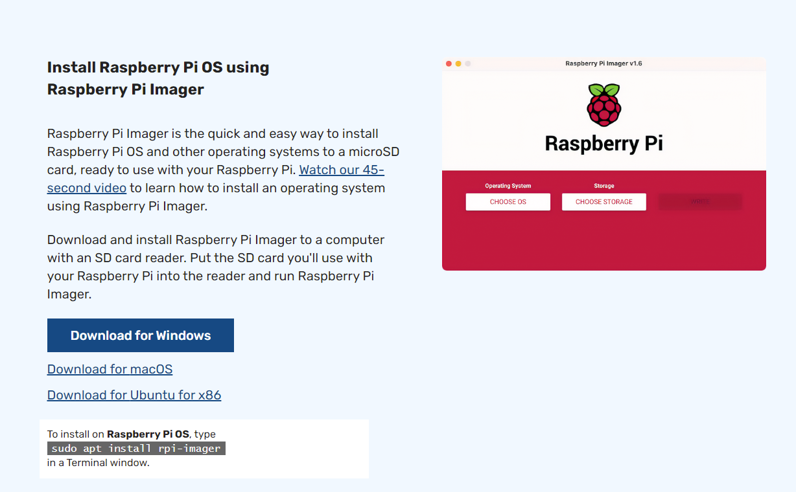
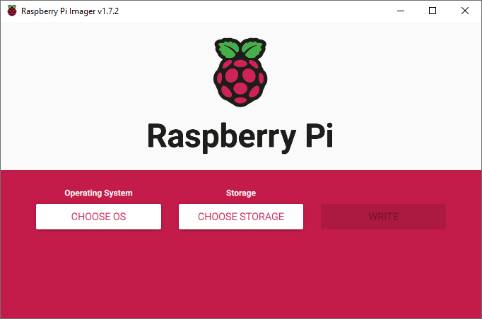
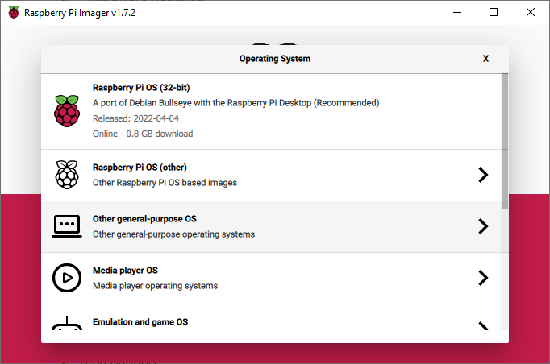
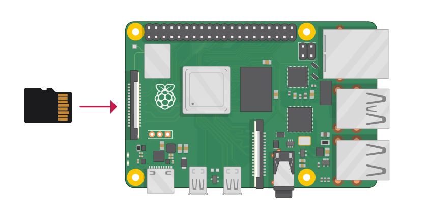

# IoT Central Device Training
## Module 01 - Setting up your Raspberry Pi

The Raspberry Pi is a fully functional computer and a variety of operating systems can be loaded and used. We like to stick with the official Raspbain OS that is based on Debian Linux and is easy to install and use.

### Configuring the OS for the RPi (Raspbian)
Our first thing to set up is your Raspbian image on the SD card that you load will into the MicroSD cart slot on the Raspberry Pi. You will need at least a 8 gig card and the ability to I/O to the card using a SD reader.

#### Install the Operating System on the SD Card

* The official _Raspberry Pi Imager_ software. This simplifies the installation of the OS onto the SD Card and handled the formatting and imaging. [LINK: Raspberry Pi Imager](https://www.raspberrypi.com/software/)



* Goto the page in the link and install the **_Raspberry Pi Imager_** software for your operating system.
* Next, fire up the **_Raspberry Pi Imager_** software...



* Press **CTRL+SHIFT+X** on the keyboard to open **Advanced options** window...


####Set the following options...

* Enable **Set Hostname:** and give your Pi a name you want or leave the default.
* Enable **Enable SSH** and set the option to **Use password authentication**
* Enable **Set username and password** to your preferences and something you can remember! :) Hint: Click the **Show password** option and insure it is all correct.
* Enable **Configure wireless LAN** and setup to your wireless network details.
* Enable **Set locale settings** to your time zone and preferred keyboard layout.

Click the **SAVE** button!

####Install the Operating System...
Click the **CHOOSE OS** button and the dialog will pop up for for OS choices to install. We are going to choose the first option **Raspberry PI OS (32-bit)**...



Click the **CHOOSE STORAGE** button and the dialog will open, find your SD card (make sure the right drive is selected) and click on it.


Click the **WRITE** button and CONFIRM you want to overwrite the card (if prompted) and start...

*Kick back and have some coffee and let everything complete...*

When teh write prcoess completes, you will see this notification...


Create a file in the root of boot called: wpa_supplicant.conf (instructions below). Then paste the following into it (adjusting for your ISO 3166 alpha-2 country code, network name and network password):

```bash
country=US
ctrl_interface=DIR=/var/run/wpa_supplicant GROUP=netdev
update_config=1

network={
    ssid="NETWORK-NAME"
    psk="NETWORK-PASSWORD"
}
```

#### Mac instructions (wifi settings)
Create a new empty file that will hold network info:

* touch /Volumes/boot/wpa_supplicant.conf
* Edit the file that you just created and paste the text above into it (adjusting for the name of your country code, network name and network password):

#### Windows instructions (wifi settings)
* Run Notepad
* Paste in the contents above (adjusting for the name of your country code, network name and network password)
* Click File / Save As ...
* Be sure to set Save as type to All Files (so the file is NOT saved with a .txt extension)
* Call the file wpa_supplicant.conf and save it
* Close the file

#### Eject the Micro SD card
* Right-click on boot (on your desktop or File Explorer) and select the Eject option
* This is a “logical” eject - meaning it closes files and preps the SD card for removal - you still have to pull the card out yourself


#### Congratulations, you have prepared your OS for the Raspberry Pi

* Make sure your RPi is not plugged in
* Looking from the top of the RPi, install the SD card (the slot is on the bottom of the board) as shown in the picture below...

 

## [NEXT: Module 02 - Getting to Know the Raspberry Pi](../Module02/README.md)